# Schema Reference

> Generated by `npm run docs:schema` from `prisma/schema.prisma` and `prisma/migrations/`. **Do not edit by hand.** `tests/schema-docs.test.mjs` fails when this file is out of date or a table lacks a classification.

PostgreSQL 16, 38 tables, 19 enums, 11 committed migrations. `prisma/schema.prisma` is the source of truth for the Prisma client; the SQL migrations additionally hold triggers, CHECK constraints and partial indexes that Prisma cannot express (see "Invariants enforced in SQL").

## Migrations

1. `202609180001_initial`
1. `202609180002_invariants`
1. `202609180003_campaign_icp_autopilot`
1. `202609180004_m365_reliability`
1. `202609180005_calendly_adapter`
1. `202609180006_versions_usage`
1. `202609180007_identity`
1. `202609180008_retention`
1. `202609180009_experiments`
1. `202609180010_growth_deliverability`
1. `202609180011_ai_assist`

Migrations are applied in order with `npm run db:deploy` and are never reset in production. See `docs/DATABASE.md` for upgrade and rollback guidance.

## Data classification and retention

Classes: **P** personal data about prospects/contacts; **U** staff account data; **S** secret or credential (encrypted or hashed); **B** business/configuration; **O** operational/system; **A** audit or compliance record.

The "Retention today" column states what the application actually does. Where it says "not purged", no automatic deletion exists.

| Table | Class | Retention today |
|---|---|---|
| `Tenant` | B | Kept until the tenant is deleted; deletion cascades to nearly every table. |
| `User` | U,S | Kept until deleted. Holds email, name, scrypt password hash, AES-256-GCM encrypted TOTP secret and hashed recovery codes. |
| `Invite` | U | Invitee email. Only the token hash is stored. Expired or accepted invitations are not purged. |
| `Lead` | B,P | Company record. `contactName`/`contactEmail` are personal and are cleared by an erasure request. |
| `Contact` | P | Prospect name, email, title, LinkedIn URL. Deleted by an erasure request; otherwise kept. |
| `DataProvider` | B,S | Defined in the schema but NOT used by any current code path (provider credentials live in TenantSetting). |
| `ICP` | B | Targeting definition. Kept. |
| `DiscoveryJob` | B | Defined in the schema but NOT used by any current code path (discovery runs are AutomationRun). |
| `Campaign` | B | Campaign configuration including sender identity. Kept; edits are versioned in CampaignVersion. |
| `SequenceStep` | B | Email copy. Kept. |
| `OutreachEvent` | P | Message subject/body and delivery state per contact. Optional retention job nulls subject/body after N days (never for queued or sending work); an erasure request nulls them and detaches the contact. |
| `Reply` | P | Free-text reply snippet. Optional retention job redacts it after N days; an erasure request deletes it. |
| `Appointment` | P,B | Meeting times, timezone, qualification notes. An erasure request detaches the contact and clears notes; the business record is kept. |
| `CampaignOutcome` | B | Defined in the schema but NOT used by any current code path (outcomes are recorded on Appointment). |
| `CalendarRoutingRule` | B | Defined in the schema but NOT used by any current code path. |
| `DeliverabilityProfile` | O | Sender health fed by signed events. Kept. |
| `AutomationRun` | O | Discovery run state and leases. Not purged. |
| `TenantSetting` | B,S | Caps, postal address, spend/retention settings, and AES-256-GCM encrypted gateway key, webhook secret and Calendly signing key. |
| `AuditEvent` | A | Who did what. Kept indefinitely (no purge implemented). Privacy events store only a hash prefix of the email, never the address. |
| `Suppression` | P,A | Do-not-contact addresses in plaintext, needed to enforce them. Kept permanently; it is the one record retained after an erasure. |
| `Session` | U,S | Hashed session tokens. Expired sessions are purged by the worker every tick. |
| `RateLimit` | O | Fixed-window counters. Expired rows are purged by the worker every tick. |
| `Enrollment` | P | Score and evidence about one contact in one campaign. Deleted with the contact. |
| `WebhookEvent` | O | Provider event IDs for de-duplication. Not purged. |
| `WorkerHeartbeat` | O | Worker liveness for readiness checks. |
| `M365Connection` | S,B | Microsoft directory/client IDs, allowlisted mailboxes and AES-256-GCM encrypted client secret. |
| `MailReceipt` | O | Send reconciliation: request hash, Graph message IDs. Holds no recipient address. |
| `MailCursor` | O | Inbox delta cursors per mailbox. |
| `OperationalAlert` | O | Alert state and delivery attempts (IDs and codes only). |
| `CampaignVersion` | B | Full snapshot of campaign settings and copy per material edit. Kept. |
| `UsageLedger` | B,A | Metering rows (discovery, emails, verifications) with cost. Contains no personal data. Not enforced as immutable by a database trigger. |
| `PasswordReset` | U,S | Token hash, expiry, used-at. Not purged. |
| `Experiment` | B | A/B test definition. Kept. |
| `ExperimentVariant` | B | Variant copy. Kept. |
| `ExperimentAssignment` | P | Links an enrollment to the arm it received. Deleted with the enrollment. |
| `ExperimentRecommendation` | B,A | Statistical verdict and the human decision on it. Kept. |
| `AccessRequest` | P | Name, email, company and message a visitor typed into the public access form or assistant. Not purged; the operator handles and should delete them. |
| `AssistantQuestion` | O | Public assistant questions it could not answer (truncated, email and phone patterns redacted) to find gaps in the knowledge base. Not purged. |

## Entity relationships

```mermaid
erDiagram
  Tenant |o--o{ User : "tenantId"
  Tenant ||--o{ Invite : "tenantId"
  Tenant ||--o{ Lead : "tenantId"
  Tenant ||--o{ Contact : "tenantId"
  Lead |o--o{ Contact : "leadId"
  Tenant ||--o{ DataProvider : "tenantId"
  Tenant ||--o{ ICP : "tenantId"
  Tenant ||--o{ DiscoveryJob : "tenantId"
  ICP |o--o{ DiscoveryJob : "icpId"
  Tenant ||--o{ Campaign : "tenantId"
  ICP |o--o{ Campaign : "icpId"
  Campaign ||--o{ SequenceStep : "campaignId"
  Tenant ||--o{ OutreachEvent : "tenantId"
  Campaign |o--o{ OutreachEvent : "campaignId"
  Lead |o--o{ OutreachEvent : "leadId"
  Contact |o--o{ OutreachEvent : "contactId"
  Tenant ||--o{ Reply : "tenantId"
  Contact |o--o{ Reply : "contactId"
  Tenant ||--o{ Appointment : "tenantId"
  Campaign |o--o{ Appointment : "campaignId"
  Contact |o--o{ Appointment : "contactId"
  Campaign ||--o{ CampaignOutcome : "campaignId"
  Campaign ||--o{ CalendarRoutingRule : "campaignId"
  Tenant ||--o{ DeliverabilityProfile : "tenantId"
  Tenant ||--o{ AutomationRun : "tenantId"
  Campaign ||--o{ AutomationRun : "campaignId"
  Tenant ||--o{ TenantSetting : "tenantId"
  User ||--o{ Session : "userId"
  Campaign ||--o{ Enrollment : "campaignId"
  Contact ||--o{ Enrollment : "contactId"
  Campaign ||--o{ CampaignVersion : "campaignId"
  Tenant ||--o{ UsageLedger : "tenantId"
  User ||--o{ PasswordReset : "userId"
  Experiment ||--o{ ExperimentVariant : "experimentId"
  Experiment ||--o{ ExperimentAssignment : "experimentId"
  ExperimentVariant ||--o{ ExperimentAssignment : "variantId"
  Experiment ||--o{ ExperimentRecommendation : "experimentId"
```

Tables also carry a plain `tenantId` (no Prisma relation) where the foreign key is added in SQL; the tenant-link triggers below reject cross-tenant references.

## Tables

### Tenant

Class B. Kept until the tenant is deleted; deletion cascades to nearly every table.

| Column | Type | Notes |
|---|---|---|
| `id` | String | primary key; default cuid() |
| `name` | String |  |
| `slug` | String | unique |
| `plan` | Plan | default FREE; enum |
| `createdAt` | DateTime | default now() |

### User

Class U,S. Kept until deleted. Holds email, name, scrypt password hash, AES-256-GCM encrypted TOTP secret and hashed recovery codes.

| Column | Type | Notes |
|---|---|---|
| `id` | String | primary key; default cuid() |
| `tenantId` | String? | FK to Tenant.id |
| `email` | String | unique |
| `name` | String? |  |
| `role` | Role | default MEMBER; enum |
| `passwordHash` | String? |  |
| `disabled` | Boolean | default false |
| `totpSecret` | String? |  |
| `theme` | String? |  |
| `mfaEnabledAt` | DateTime? |  |
| `totpLastStep` | Int? |  |
| `recoveryHashes` | String[] | default [] |
| `createdAt` | DateTime | default now() |

### Invite

Class U. Invitee email. Only the token hash is stored. Expired or accepted invitations are not purged.

| Column | Type | Notes |
|---|---|---|
| `id` | String | primary key; default cuid() |
| `tenantId` | String | FK to Tenant.id |
| `email` | String |  |
| `role` | Role | enum |
| `tokenHash` | String | unique |
| `expiresAt` | DateTime |  |
| `acceptedAt` | DateTime? |  |

### Lead

Class B,P. Company record. `contactName`/`contactEmail` are personal and are cleared by an erasure request.

| Column | Type | Notes |
|---|---|---|
| `id` | String | primary key; default cuid() |
| `tenantId` | String | FK to Tenant.id |
| `company` | String |  |
| `domain` | String? |  |
| `contactName` | String? |  |
| `contactEmail` | String? |  |
| `score` | Int | default 0 |
| `qualification` | QualificationStatus | default UNCHECKED; enum |
| `status` | LeadStatus | default NEW; enum |
| `reason` | String? |  |
| `source` | String? |  |
| `signalSummary` | String? |  |
| `disqualificationReason` | String? |  |
| `calendlyUrl` | String? |  |
| `createdAt` | DateTime | default now() |

Constraints/indexes declared in the schema: `@@unique([tenantId, domain])`, `@@index([tenantId, status])`, `@@index([tenantId, score])`, `@@index([tenantId, qualification])`

### Contact

Class P. Prospect name, email, title, LinkedIn URL. Deleted by an erasure request; otherwise kept.

| Column | Type | Notes |
|---|---|---|
| `id` | String | primary key; default cuid() |
| `tenantId` | String | FK to Tenant.id |
| `leadId` | String? | FK to Lead.id |
| `fullName` | String |  |
| `title` | String? |  |
| `role` | ContactRole | default OTHER; enum |
| `email` | String? |  |
| `linkedinUrl` | String? |  |
| `verification` | ContactVerificationStatus | default UNKNOWN; enum |
| `sourceProvider` | ProviderKind? | enum |
| `lastVerifiedAt` | DateTime? |  |
| `reverifyRequestedAt` | DateTime? |  |
| `verificationAttempts` | Int | default 0 |
| `verificationNextAt` | DateTime | default now() |
| `verificationLeaseUntil` | DateTime? |  |
| `createdAt` | DateTime | default now() |

Constraints/indexes declared in the schema: `@@unique([tenantId, email])`, `@@index([tenantId, role])`, `@@index([tenantId, email])`

### DataProvider

Class B,S. Defined in the schema but NOT used by any current code path (provider credentials live in TenantSetting).

| Column | Type | Notes |
|---|---|---|
| `id` | String | primary key; default cuid() |
| `tenantId` | String | FK to Tenant.id |
| `kind` | ProviderKind | enum |
| `name` | String |  |
| `enabled` | Boolean | default false |
| `encryptedConfig` | String? |  |
| `priority` | Int | default 100 |
| `createdAt` | DateTime | default now() |

Constraints/indexes declared in the schema: `@@unique([tenantId, kind, name])`

### ICP

Class B. Targeting definition. Kept.

| Column | Type | Notes |
|---|---|---|
| `id` | String | primary key; default cuid() |
| `tenantId` | String | FK to Tenant.id |
| `name` | String |  |
| `offer` | String |  |
| `industries` | String[] |  |
| `companySizes` | String[] |  |
| `geographies` | String[] |  |
| `technologies` | String[] |  |
| `buyingSignals` | String[] |  |
| `buyerTitles` | String[] |  |
| `exclusionRules` | String[] | default [] |
| `scoreWeights` | Json | default "{}" |
| `minScore` | Int | default 75 |
| `weeklyAppointmentGoal` | Int | default 5 |
| `active` | Boolean | default true |
| `createdAt` | DateTime | default now() |

Constraints/indexes declared in the schema: `@@index([tenantId, active])`

### DiscoveryJob

Class B. Defined in the schema but NOT used by any current code path (discovery runs are AutomationRun).

| Column | Type | Notes |
|---|---|---|
| `id` | String | primary key; default cuid() |
| `tenantId` | String | FK to Tenant.id |
| `icpId` | String? | FK to ICP.id |
| `name` | String |  |
| `status` | DiscoveryJobStatus | default DRAFT; enum |
| `offer` | String |  |
| `targetTitles` | String[] |  |
| `industries` | String[] |  |
| `locations` | String[] |  |
| `keywords` | String[] |  |
| `excludedDomains` | String[] | default [] |
| `weeklyProspectLimit` | Int | default 50 |
| `minScore` | Int | default 70 |
| `calendlyUrl` | String? |  |
| `lastRunAt` | DateTime? |  |
| `nextRunAt` | DateTime? |  |
| `createdAt` | DateTime | default now() |

Constraints/indexes declared in the schema: `@@index([tenantId, status])`, `@@index([tenantId, icpId])`

### Campaign

Class B. Campaign configuration including sender identity. Kept; edits are versioned in CampaignVersion.

| Column | Type | Notes |
|---|---|---|
| `id` | String | primary key; default cuid() |
| `tenantId` | String | FK to Tenant.id |
| `icpId` | String? | FK to ICP.id |
| `name` | String |  |
| `status` | CampaignStatus | default DRAFT; enum |
| `automationMode` | AutomationMode | default FULLY_AUTOMATIC; enum |
| `offer` | String? |  |
| `senderName` | String |  |
| `senderEmail` | String |  |
| `calendlyUrl` | String |  |
| `dailySendCap` | Int | default 25 |
| `weeklyProspectCap` | Int | default 50 |
| `weeklyAppointmentGoal` | Int | default 5 |
| `minScore` | Int | default 75 |
| `minAppointmentQualityScore` | Int | default 80 |
| `businessDaysOnly` | Boolean | default true |
| `stopOnReply` | Boolean | default true |
| `channels` | Channel[] | default [EMAIL]; enum |
| `timezone` | String | default "America/Los_Angeles" |
| `sendStartHour` | Int | default 9 |
| `sendEndHour` | Int | default 17 |
| `nextRunAt` | DateTime | default now() |
| `outcomeType` | CampaignOutcomeType | default APPOINTMENT_BOOKED; enum |
| `createdAt` | DateTime | default now() |
| `version` | Int | default 1 |
| `holidays` | String[] | default [] |

Constraints/indexes declared in the schema: `@@index([tenantId, status])`, `@@index([tenantId, icpId])`, `@@index([status, nextRunAt])`

### SequenceStep

Class B. Email copy. Kept.

| Column | Type | Notes |
|---|---|---|
| `id` | String | primary key; default cuid() |
| `campaignId` | String | FK to Campaign.id |
| `stepOrder` | Int |  |
| `type` | SequenceStepType | default EMAIL; enum |
| `waitBusinessDays` | Int | default 0 |
| `subject` | String? |  |
| `body` | String |  |

Constraints/indexes declared in the schema: `@@unique([campaignId, stepOrder])`

### OutreachEvent

Class P. Message subject/body and delivery state per contact. Optional retention job nulls subject/body after N days (never for queued or sending work); an erasure request nulls them and detaches the contact.

| Column | Type | Notes |
|---|---|---|
| `id` | String | primary key; default cuid() |
| `tenantId` | String | FK to Tenant.id |
| `campaignId` | String? | FK to Campaign.id |
| `leadId` | String? | FK to Lead.id |
| `contactId` | String? | FK to Contact.id |
| `stepOrder` | Int? |  |
| `status` | OutreachStatus | default QUEUED; enum |
| `purpose` | OutreachPurpose | default SEQUENCE; enum |
| `providerMessageId` | String? |  |
| `scheduledAt` | DateTime? |  |
| `sentAt` | DateTime? |  |
| `error` | String? |  |
| `idempotencyKey` | String | unique; default cuid() |
| `approvedAt` | DateTime? |  |
| `attempts` | Int | default 0 |
| `leaseUntil` | DateTime? |  |
| `leaseToken` | String? |  |
| `reservedAt` | DateTime? |  |
| `subject` | String? |  |
| `body` | String? |  |
| `createdAt` | DateTime | default now() |

Constraints/indexes declared in the schema: `@@index([tenantId, status])`, `@@index([tenantId, scheduledAt])`

### Reply

Class P. Free-text reply snippet. Optional retention job redacts it after N days; an erasure request deletes it.

| Column | Type | Notes |
|---|---|---|
| `id` | String | primary key; default cuid() |
| `tenantId` | String | FK to Tenant.id |
| `contactId` | String? | FK to Contact.id |
| `intent` | ReplyIntent | default UNSURE; enum |
| `rawSnippet` | String |  |
| `recommendedAction` | String? |  |
| `bookedAt` | DateTime? |  |
| `createdAt` | DateTime | default now() |

Constraints/indexes declared in the schema: `@@index([tenantId, intent])`

### Appointment

Class P,B. Meeting times, timezone, qualification notes. An erasure request detaches the contact and clears notes; the business record is kept.

| Column | Type | Notes |
|---|---|---|
| `id` | String | primary key; default cuid() |
| `tenantId` | String | FK to Tenant.id |
| `campaignId` | String? | FK to Campaign.id |
| `contactId` | String? | FK to Contact.id |
| `providerEventId` | String? |  |
| `providerUpdatedAt` | DateTime? |  |
| `qualified` | Boolean | default false |
| `status` | AppointmentStatus | default REQUESTED; enum |
| `calendlyEventUri` | String? |  |
| `scheduledStart` | DateTime? |  |
| `scheduledEnd` | DateTime? |  |
| `timezone` | String? |  |
| `qualificationNotes` | String? |  |
| `qualityScore` | Int? |  |
| `outcomeReason` | String? |  |
| `createdAt` | DateTime | default now() |

Constraints/indexes declared in the schema: `@@unique([tenantId, providerEventId])`, `@@index([tenantId, status])`, `@@index([tenantId, scheduledStart])`

### CampaignOutcome

Class B. Defined in the schema but NOT used by any current code path (outcomes are recorded on Appointment).

| Column | Type | Notes |
|---|---|---|
| `id` | String | primary key; default cuid() |
| `campaignId` | String | FK to Campaign.id |
| `type` | CampaignOutcomeType | enum |
| `count` | Int | default 0 |
| `targetCount` | Int | default 0 |
| `notes` | String? |  |
| `measuredAt` | DateTime | default now() |

Constraints/indexes declared in the schema: `@@index([campaignId, type])`

### CalendarRoutingRule

Class B. Defined in the schema but NOT used by any current code path.

| Column | Type | Notes |
|---|---|---|
| `id` | String | primary key; default cuid() |
| `campaignId` | String | FK to Campaign.id |
| `name` | String |  |
| `calendlyUrl` | String |  |
| `timezone` | String | default "America/Los_Angeles" |
| `minScore` | Int | default 75 |
| `ownerEmail` | String? |  |
| `active` | Boolean | default true |

Constraints/indexes declared in the schema: `@@index([campaignId, active])`

### DeliverabilityProfile

Class O. Sender health fed by signed events. Kept.

| Column | Type | Notes |
|---|---|---|
| `id` | String | primary key; default cuid() |
| `tenantId` | String | FK to Tenant.id |
| `senderEmail` | String |  |
| `domain` | String |  |
| `status` | DeliverabilityStatus | default HEALTHY; enum |
| `dailyCap` | Int | default 25 |
| `bounceRate` | Float | default 0 |
| `complaintRate` | Float | default 0 |
| `positiveReplyRate` | Float | default 0 |
| `lastCheckedAt` | DateTime? |  |
| `spfStatus` | String? |  |
| `dkimStatus` | String? |  |
| `dmarcStatus` | String? |  |
| `authCheckedAt` | DateTime? |  |
| `healthSource` | String | default "external" |
| `detail` | Json? |  |
| `createdAt` | DateTime | default now() |

Constraints/indexes declared in the schema: `@@unique([tenantId, senderEmail])`

### AutomationRun

Class O. Discovery run state and leases. Not purged.

| Column | Type | Notes |
|---|---|---|
| `id` | String | primary key; default cuid() |
| `tenantId` | String | FK to Tenant.id |
| `campaignId` | String | FK to Campaign.id |
| `status` | RunStatus | default QUEUED; enum |
| `startedAt` | DateTime? |  |
| `finishedAt` | DateTime? |  |
| `prospectsFound` | Int | default 0 |
| `contactsVerified` | Int | default 0 |
| `messagesQueued` | Int | default 0 |
| `repliesClassified` | Int | default 0 |
| `appointmentsBooked` | Int | default 0 |
| `errors` | Json? |  |
| `idempotencyKey` | String | unique; default cuid() |
| `attempts` | Int | default 0 |
| `leaseUntil` | DateTime? |  |
| `leaseToken` | String? |  |
| `availableAt` | DateTime | default now() |
| `createdAt` | DateTime | default now() |

Constraints/indexes declared in the schema: `@@index([tenantId, status])`, `@@index([campaignId, createdAt])`

### TenantSetting

Class B,S. Caps, postal address, spend/retention settings, and AES-256-GCM encrypted gateway key, webhook secret and Calendly signing key.

| Column | Type | Notes |
|---|---|---|
| `id` | String | primary key; default cuid() |
| `tenantId` | String | unique; FK to Tenant.id |
| `emailProvider` | String? |  |
| `encryptedConfig` | String? |  |
| `dailySendCap` | Int | default 100 |
| `weeklyProspectCap` | Int | default 50 |
| `defaultCalendlyUrl` | String? |  |
| `senderName` | String? |  |
| `senderEmail` | String? |  |
| `automationEnabled` | Boolean | default false |
| `postalAddress` | String? |  |
| `gatewayKey` | String? |  |
| `webhookSecret` | String? |  |
| `calendlySigningKey` | String? |  |
| `monthlySpendCapCents` | Int? |  |
| `providerCostCents` | Int | default 0 |
| `suspended` | Boolean | default false |
| `messageRetentionDays` | Int? |  |
| `calendlyToken` | String? |  |
| `calendlyOrganizationUri` | String? |  |
| `calendlyReconciledAt` | DateTime? |  |
| `aiEnabled` | Boolean | default false |
| `aiBaseUrl` | String? |  |
| `aiModel` | String? |  |
| `aiKey` | String? |  |
| `aiFeatures` | String[] | default [] |

### AuditEvent

Class A. Who did what. Kept indefinitely (no purge implemented). Privacy events store only a hash prefix of the email, never the address.

| Column | Type | Notes |
|---|---|---|
| `id` | String | primary key; default cuid() |
| `tenantId` | String? |  |
| `actorUserId` | String? |  |
| `action` | String |  |
| `entity` | String? |  |
| `entityId` | String? |  |
| `ipHash` | String? |  |
| `metadata` | Json? |  |
| `createdAt` | DateTime | default now() |

Constraints/indexes declared in the schema: `@@index([tenantId, createdAt])`

### Suppression

Class P,A. Do-not-contact addresses in plaintext, needed to enforce them. Kept permanently; it is the one record retained after an erasure.

| Column | Type | Notes |
|---|---|---|
| `id` | String | primary key; default cuid() |
| `tenantId` | String |  |
| `email` | String |  |
| `reason` | String |  |
| `createdAt` | DateTime | default now() |

Constraints/indexes declared in the schema: `@@unique([tenantId, email])`

### Session

Class U,S. Hashed session tokens. Expired sessions are purged by the worker every tick.

| Column | Type | Notes |
|---|---|---|
| `id` | String | primary key; default cuid() |
| `tokenHash` | String | unique |
| `userId` | String | FK to User.id |
| `expiresAt` | DateTime |  |
| `createdAt` | DateTime | default now() |

Constraints/indexes declared in the schema: `@@index([expiresAt])`

### RateLimit

Class O. Fixed-window counters. Expired rows are purged by the worker every tick.

| Column | Type | Notes |
|---|---|---|
| `key` | String | primary key |
| `count` | Int | default 0 |
| `expiresAt` | DateTime |  |

### Enrollment

Class P. Score and evidence about one contact in one campaign. Deleted with the contact.

| Column | Type | Notes |
|---|---|---|
| `id` | String | primary key; default cuid() |
| `tenantId` | String |  |
| `campaignId` | String | FK to Campaign.id |
| `contactId` | String | FK to Contact.id |
| `score` | Int |  |
| `hasBuyer` | Boolean |  |
| `hasPainSignal` | Boolean |  |
| `evidence` | Json |  |
| `stoppedAt` | DateTime? |  |
| `stopReason` | String? |  |
| `createdAt` | DateTime | default now() |

Constraints/indexes declared in the schema: `@@unique([campaignId, contactId])`, `@@index([tenantId, contactId, stoppedAt])`

### WebhookEvent

Class O. Provider event IDs for de-duplication. Not purged.

| Column | Type | Notes |
|---|---|---|
| `id` | String | primary key; default cuid() |
| `tenantId` | String |  |
| `providerEventId` | String |  |
| `type` | String |  |
| `createdAt` | DateTime | default now() |

Constraints/indexes declared in the schema: `@@unique([tenantId, providerEventId])`

### WorkerHeartbeat

Class O. Worker liveness for readiness checks.

| Column | Type | Notes |
|---|---|---|
| `id` | String | primary key |
| `updatedAt` | DateTime |  |

### M365Connection

Class S,B. Microsoft directory/client IDs, allowlisted mailboxes and AES-256-GCM encrypted client secret.

| Column | Type | Notes |
|---|---|---|
| `tenantId` | String | primary key |
| `directoryId` | String | unique |
| `clientId` | String |  |
| `encryptedSecret` | String |  |
| `mailboxes` | String[] |  |
| `enabled` | Boolean | default true |
| `connectedAt` | DateTime | default now() |

### MailReceipt

Class O. Send reconciliation: request hash, Graph message IDs. Holds no recipient address.

| Column | Type | Notes |
|---|---|---|
| `id` | String | primary key; default cuid() |
| `tenantId` | String |  |
| `key` | String | unique |
| `requestHash` | String |  |
| `mailbox` | String |  |
| `status` | String | default "NEW" |
| `draftId` | String? |  |
| `internetMessageId` | String? |  |
| `conversationId` | String? |  |
| `sentConfirmedAt` | DateTime? |  |
| `error` | String? |  |
| `createdAt` | DateTime | default now() |
| `updatedAt` | DateTime |  |

Constraints/indexes declared in the schema: `@@index([tenantId, status])`, `@@index([tenantId, mailbox, internetMessageId])`

### MailCursor

Class O. Inbox delta cursors per mailbox.

| Column | Type | Notes |
|---|---|---|
| `id` | String | primary key; default cuid() |
| `tenantId` | String |  |
| `mailbox` | String |  |
| `cursor` | String? |  |
| `leaseToken` | String? |  |
| `leaseUntil` | DateTime? |  |
| `nextPollAt` | DateTime | default now() |
| `lastSuccessAt` | DateTime? |  |
| `error` | String? |  |

Constraints/indexes declared in the schema: `@@unique([tenantId, mailbox])`

### OperationalAlert

Class O. Alert state and delivery attempts (IDs and codes only).

| Column | Type | Notes |
|---|---|---|
| `id` | String | primary key; default cuid() |
| `tenantId` | String |  |
| `key` | String | unique |
| `code` | String |  |
| `entityId` | String |  |
| `createdAt` | DateTime | default now() |
| `deliveredAt` | DateTime? |  |
| `acknowledgedAt` | DateTime? |  |
| `attempts` | Int | default 0 |
| `nextAttemptAt` | DateTime | default now() |
| `leaseToken` | String? |  |
| `leaseUntil` | DateTime? |  |

Constraints/indexes declared in the schema: `@@index([tenantId, createdAt])`

### CampaignVersion

Class B. Full snapshot of campaign settings and copy per material edit. Kept.

| Column | Type | Notes |
|---|---|---|
| `id` | String | primary key; default cuid() |
| `tenantId` | String |  |
| `campaignId` | String | FK to Campaign.id |
| `version` | Int |  |
| `snapshot` | Json |  |
| `reason` | String |  |
| `actorUserId` | String? |  |
| `createdAt` | DateTime | default now() |

Constraints/indexes declared in the schema: `@@unique([campaignId, version])`, `@@index([tenantId])`

### UsageLedger

Class B,A. Metering rows (discovery, emails, verifications) with cost. Contains no personal data. Not enforced as immutable by a database trigger.

| Column | Type | Notes |
|---|---|---|
| `id` | String | primary key; default cuid() |
| `tenantId` | String | FK to Tenant.id |
| `campaignId` | String? |  |
| `kind` | String |  |
| `quantity` | Int |  |
| `costCents` | Int |  |
| `idempotencyKey` | String |  |
| `createdAt` | DateTime | default now() |

Constraints/indexes declared in the schema: `@@unique([tenantId, idempotencyKey])`, `@@index([tenantId, createdAt])`

### PasswordReset

Class U,S. Token hash, expiry, used-at. Not purged.

| Column | Type | Notes |
|---|---|---|
| `id` | String | primary key; default cuid() |
| `userId` | String | FK to User.id |
| `tokenHash` | String | unique |
| `expiresAt` | DateTime |  |
| `usedAt` | DateTime? |  |
| `createdAt` | DateTime | default now() |

Constraints/indexes declared in the schema: `@@index([userId])`

### Experiment

Class B. A/B test definition. Kept.

| Column | Type | Notes |
|---|---|---|
| `id` | String | primary key; default cuid() |
| `tenantId` | String |  |
| `campaignId` | String |  |
| `stepOrder` | Int |  |
| `name` | String |  |
| `status` | String | default "DRAFT" |
| `primaryMetric` | String | default "POSITIVE_REPLY" |
| `minSample` | Int | default 100 |
| `createdAt` | DateTime | default now() |
| `startedAt` | DateTime? |  |
| `concludedAt` | DateTime? |  |

Constraints/indexes declared in the schema: `@@index([tenantId, campaignId])`

### ExperimentVariant

Class B. Variant copy. Kept.

| Column | Type | Notes |
|---|---|---|
| `id` | String | primary key; default cuid() |
| `tenantId` | String |  |
| `experimentId` | String | FK to Experiment.id |
| `label` | String |  |
| `isControl` | Boolean | default false |
| `subject` | String? |  |
| `body` | String? |  |
| `weight` | Int | default 1 |

Constraints/indexes declared in the schema: `@@unique([experimentId, label])`

### ExperimentAssignment

Class P. Links an enrollment to the arm it received. Deleted with the enrollment.

| Column | Type | Notes |
|---|---|---|
| `id` | String | primary key; default cuid() |
| `tenantId` | String |  |
| `experimentId` | String | FK to Experiment.id |
| `variantId` | String | FK to ExperimentVariant.id |
| `enrollmentId` | String |  |
| `createdAt` | DateTime | default now() |

Constraints/indexes declared in the schema: `@@unique([experimentId, enrollmentId])`, `@@index([variantId])`

### ExperimentRecommendation

Class B,A. Statistical verdict and the human decision on it. Kept.

| Column | Type | Notes |
|---|---|---|
| `id` | String | primary key; default cuid() |
| `tenantId` | String |  |
| `experimentId` | String | FK to Experiment.id |
| `variantId` | String |  |
| `status` | String | default "OPEN" |
| `verdict` | Json |  |
| `decidedBy` | String? |  |
| `decidedAt` | DateTime? |  |
| `createdAt` | DateTime | default now() |

Constraints/indexes declared in the schema: `@@unique([experimentId, variantId])`

### AccessRequest

Class P. Name, email, company and message a visitor typed into the public access form or assistant. Not purged; the operator handles and should delete them.

| Column | Type | Notes |
|---|---|---|
| `id` | String | primary key; default cuid() |
| `name` | String |  |
| `email` | String |  |
| `company` | String? |  |
| `message` | String? |  |
| `plan` | String? |  |
| `source` | String |  |
| `handledAt` | DateTime? |  |
| `createdAt` | DateTime | default now() |

Constraints/indexes declared in the schema: `@@index([createdAt])`

### AssistantQuestion

Class O. Public assistant questions it could not answer (truncated, email and phone patterns redacted) to find gaps in the knowledge base. Not purged.

| Column | Type | Notes |
|---|---|---|
| `id` | String | primary key; default cuid() |
| `question` | String |  |
| `audience` | String |  |
| `createdAt` | DateTime | default now() |

Constraints/indexes declared in the schema: `@@index([createdAt])`

## Enums

- `Role`: SUPER_ADMIN, TENANT_ADMIN, MANAGER, MEMBER
- `Plan`: FREE, STARTER, GROWTH, SCALE, ENTERPRISE
- `LeadStatus`: NEW, QUALIFIED, CONTACTED, REPLIED, MEETING, WON, LOST, SUPPRESSED
- `ProviderKind`: APOLLO, HUNTER, ROCKETREACH, CLAY, PEOPLE_DATA_LABS, CUSTOM
- `DiscoveryJobStatus`: DRAFT, ACTIVE, PAUSED, COMPLETE, FAILED
- `ContactRole`: CTO, VP_ENGINEERING, ENGINEERING_MANAGER, QA_DIRECTOR, QA_MANAGER, HEAD_OF_QUALITY, OTHER
- `ContactVerificationStatus`: UNKNOWN, VALID, RISKY, INVALID
- `CampaignStatus`: DRAFT, ACTIVE, PAUSED, COMPLETE
- `SequenceStepType`: EMAIL, LINKEDIN_TASK, CALL_TASK
- `OutreachStatus`: QUEUED, SENDING, CANCELED, SENT, OPENED, CLICKED, REPLIED, BOUNCED, UNSUBSCRIBED, FAILED
- `OutreachPurpose`: SEQUENCE, BOOKING_INVITATION
- `ReplyIntent`: POSITIVE, NEUTRAL, OBJECTION, NEGATIVE, OUT_OF_OFFICE, UNSURE
- `Channel`: EMAIL, LINKEDIN, PHONE, WEB_FORM
- `AppointmentStatus`: REQUESTED, BOOKED, COMPLETED, NO_SHOW, CANCELED, DISQUALIFIED, WON, LOST
- `DeliverabilityStatus`: HEALTHY, WATCHLIST, THROTTLED, BLOCKED
- `CampaignOutcomeType`: APPOINTMENT_BOOKED, QUALIFIED_OPPORTUNITY, DISQUALIFIED, NO_SHOW, WON, LOST
- `RunStatus`: QUEUED, RUNNING, SUCCEEDED, PARTIAL, FAILED, CANCELED
- `AutomationMode`: FULLY_AUTOMATIC, REVIEW_BEFORE_SEND, REVIEW_BEFORE_BOOKING, PAUSED
- `QualificationStatus`: UNCHECKED, QUALIFIED, NEEDS_REVIEW, DISQUALIFIED

## Invariants enforced in SQL

Hand-written database rules extracted from the migrations: functions, tenant-link triggers, CHECK constraints and partial unique indexes. These hold even if application code is wrong. Routine foreign keys are shown in the table sections above.

### 202609180002_invariants

- `CREATE FUNCTION leadmelo_check_tenant_links() RETURNS trigger LANGUAGE plpgsql AS $$`
- `CREATE TRIGGER tenant_links BEFORE INSERT OR UPDATE ON "Campaign" FOR EACH ROW EXECUTE FUNCTION leadmelo_check_tenant_links('icpId','ICP');`
- `CREATE TRIGGER tenant_links BEFORE INSERT OR UPDATE ON "DiscoveryJob" FOR EACH ROW EXECUTE FUNCTION leadmelo_check_tenant_links('icpId','ICP');`
- `CREATE TRIGGER tenant_links BEFORE INSERT OR UPDATE ON "Contact" FOR EACH ROW EXECUTE FUNCTION leadmelo_check_tenant_links('leadId','Lead');`
- `CREATE TRIGGER tenant_links BEFORE INSERT OR UPDATE ON "Enrollment" FOR EACH ROW EXECUTE FUNCTION leadmelo_check_tenant_links('campaignId','Campaign','contactId','Contact');`
- `CREATE TRIGGER tenant_links BEFORE INSERT OR UPDATE ON "AutomationRun" FOR EACH ROW EXECUTE FUNCTION leadmelo_check_tenant_links('campaignId','Campaign');`
- `CREATE TRIGGER tenant_links BEFORE INSERT OR UPDATE ON "OutreachEvent" FOR EACH ROW EXECUTE FUNCTION leadmelo_check_tenant_links('campaignId','Campaign','contactId','Contact','leadId','Lead');`
- `CREATE TRIGGER tenant_links BEFORE INSERT OR UPDATE ON "Reply" FOR EACH ROW EXECUTE FUNCTION leadmelo_check_tenant_links('contactId','Contact');`
- `CREATE TRIGGER tenant_links BEFORE INSERT OR UPDATE ON "Appointment" FOR EACH ROW EXECUTE FUNCTION leadmelo_check_tenant_links('campaignId','Campaign','contactId','Contact');`
- `ALTER TABLE "Campaign" ADD CONSTRAINT campaign_limits CHECK ("dailySendCap">0 AND "weeklyProspectCap">0 AND "minScore" BETWEEN 0 AND 100 AND "minAppointmentQualityScore" BETWEEN 0 AND 100 AND "sendStartHour">=0 AND "sendEndHour"<=24 AND "sendStartHour"<"sendEn`
- `ALTER TABLE "Appointment" ADD CONSTRAINT appointment_interval CHECK ("scheduledEnd" IS NULL OR "scheduledStart" IS NULL OR "scheduledEnd">"scheduledStart");`
- `ALTER TABLE "ICP" ADD CONSTRAINT icp_score CHECK ("minScore" BETWEEN 0 AND 100);`
- `ALTER TABLE "Enrollment" ADD CONSTRAINT enrollment_score CHECK (score BETWEEN 0 AND 100);`
- `CREATE UNIQUE INDEX one_active_enrollment_per_contact ON "Enrollment" ("tenantId", "contactId") WHERE "stoppedAt" IS NULL;`

### 202609180004_m365_reliability

- `ALTER TABLE "MailReceipt" ADD CONSTRAINT mail_receipt_status CHECK (status IN ('NEW','CREATING','DRAFT','SUBMITTING','ACCEPTED','AMBIGUOUS'));`

### 202609180006_versions_usage

- `ALTER TABLE "TenantSetting" ADD CONSTRAINT tenant_spend_nonnegative CHECK (("monthlySpendCapCents" IS NULL OR "monthlySpendCapCents" >= 0) AND "providerCostCents" >= 0);`
- `CREATE TRIGGER tenant_links BEFORE INSERT OR UPDATE ON "CampaignVersion" FOR EACH ROW EXECUTE FUNCTION leadmelo_check_tenant_links('campaignId','Campaign');`
- `CONSTRAINT usage_nonnegative CHECK ("quantity" >= 0 AND "costCents" >= 0)`
- `CREATE TRIGGER tenant_links BEFORE INSERT OR UPDATE ON "UsageLedger" FOR EACH ROW EXECUTE FUNCTION leadmelo_check_tenant_links('campaignId','Campaign');`

### 202609180008_retention

- `ALTER TABLE "TenantSetting" ADD CONSTRAINT retention_minimum CHECK ("messageRetentionDays" IS NULL OR "messageRetentionDays" >= 30);`

### 202609180009_experiments

- `CONSTRAINT experiment_status CHECK ("status" IN ('DRAFT','RUNNING','STOPPED','CONCLUDED')),`
- `CONSTRAINT experiment_metric CHECK ("primaryMetric" IN ('POSITIVE_REPLY','BOOKED','ATTENDED')),`
- `CONSTRAINT experiment_limits CHECK ("stepOrder" >= 1 AND "minSample" >= 20)`
- `CONSTRAINT variant_weight CHECK ("weight" BETWEEN 1 AND 100000),`
- `CONSTRAINT variant_copy CHECK ("isControl" OR ("subject" IS NOT NULL AND "body" IS NOT NULL))`
- `CONSTRAINT recommendation_status CHECK ("status" IN ('OPEN','ACCEPTED','REJECTED'))`
- `CREATE UNIQUE INDEX one_running_experiment_per_step ON "Experiment" ("campaignId", "stepOrder") WHERE "status" = 'RUNNING';`
- `CREATE UNIQUE INDEX one_control_per_experiment ON "ExperimentVariant" ("experimentId") WHERE "isControl";`
- `CREATE TRIGGER tenant_links BEFORE INSERT OR UPDATE ON "Experiment" FOR EACH ROW EXECUTE FUNCTION leadmelo_check_tenant_links('campaignId','Campaign');`
- `CREATE TRIGGER tenant_links BEFORE INSERT OR UPDATE ON "ExperimentVariant" FOR EACH ROW EXECUTE FUNCTION leadmelo_check_tenant_links('experimentId','Experiment');`
- `CREATE TRIGGER tenant_links BEFORE INSERT OR UPDATE ON "ExperimentAssignment" FOR EACH ROW EXECUTE FUNCTION leadmelo_check_tenant_links('experimentId','Experiment','variantId','ExperimentVariant','enrollmentId','Enrollment');`
- `CREATE TRIGGER tenant_links BEFORE INSERT OR UPDATE ON "ExperimentRecommendation" FOR EACH ROW EXECUTE FUNCTION leadmelo_check_tenant_links('experimentId','Experiment');`

### 202609180010_growth_deliverability

- `CONSTRAINT access_request_source CHECK ("source" IN ('pricing','assistant','contact'))`
- `ALTER TABLE "DeliverabilityProfile" ADD CONSTRAINT health_source CHECK ("healthSource" IN ('external','internal'));`
- `ALTER TABLE "User" ADD CONSTRAINT user_theme CHECK ("theme" IS NULL OR "theme" IN ('system','light','dark','ocean','forest','sunset'));`

